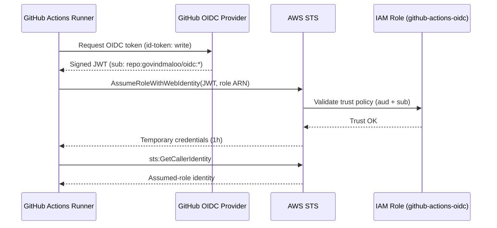

# GitHub Actions → AWS via OIDC

A minimal example of authenticating GitHub Actions to AWS using OpenID Connect (OIDC)
instead of long-lived access keys. The workflow assumes an IAM role and verifies the
assumed identity with `aws sts get-caller-identity`.

## How it works

1. GitHub mints a short-lived OIDC token for the workflow run (`id-token: write`).
2. `aws-actions/configure-aws-credentials` exchanges that token with AWS STS via
   `AssumeRoleWithWebIdentity`.
3. AWS returns temporary credentials for the `github-actions-oidc` role, scoped by a
   trust policy to this repository.
4. The workflow runs `aws sts get-caller-identity` to confirm the assumed role.

No AWS access keys are ever stored in the repository.



## Repository layout

| Path | Description |
| --- | --- |
| `.github/workflows/aws-oidc.yml` | The GitHub Actions workflow. |
| `docs/AWS_OIDC_SETUP.md` | Step-by-step AWS/GitHub setup guide. |

## Workflow triggers

- **`push`** to `main`
- **`workflow_dispatch`** (manual run, with an optional `aws_region` input)

## Configuration

The workflow reads the role ARN from a repository secret and resolves the region as
`inputs.aws_region` → `vars.AWS_REGION` → `ap-south-1`.

| Type | Name | Required | Example |
| --- | --- | --- | --- |
| Secret | `AWS_ROLE_ARN` | Yes | `arn:aws:iam::232818307988:role/github-actions-oidc` |
| Variable | `AWS_REGION` | No | `ap-south-1` |

## Setup

The AWS resources (OIDC provider, IAM role, repository secret) for this repo are
already provisioned. To reproduce the setup from scratch, follow
[docs/AWS_OIDC_SETUP.md](docs/AWS_OIDC_SETUP.md).

## Running it

Push to `main`, or trigger manually:

```bash
gh workflow run "AWS OIDC Caller Identity"
```

A successful run prints the assumed-role identity:

```json
{
  "UserId": "AROATMNINOOKALLOJ2HRZ:github-actions-<run_id>",
  "Account": "232818307988",
  "Arn": "arn:aws:sts::232818307988:assumed-role/github-actions-oidc/github-actions-<run_id>"
}
```
